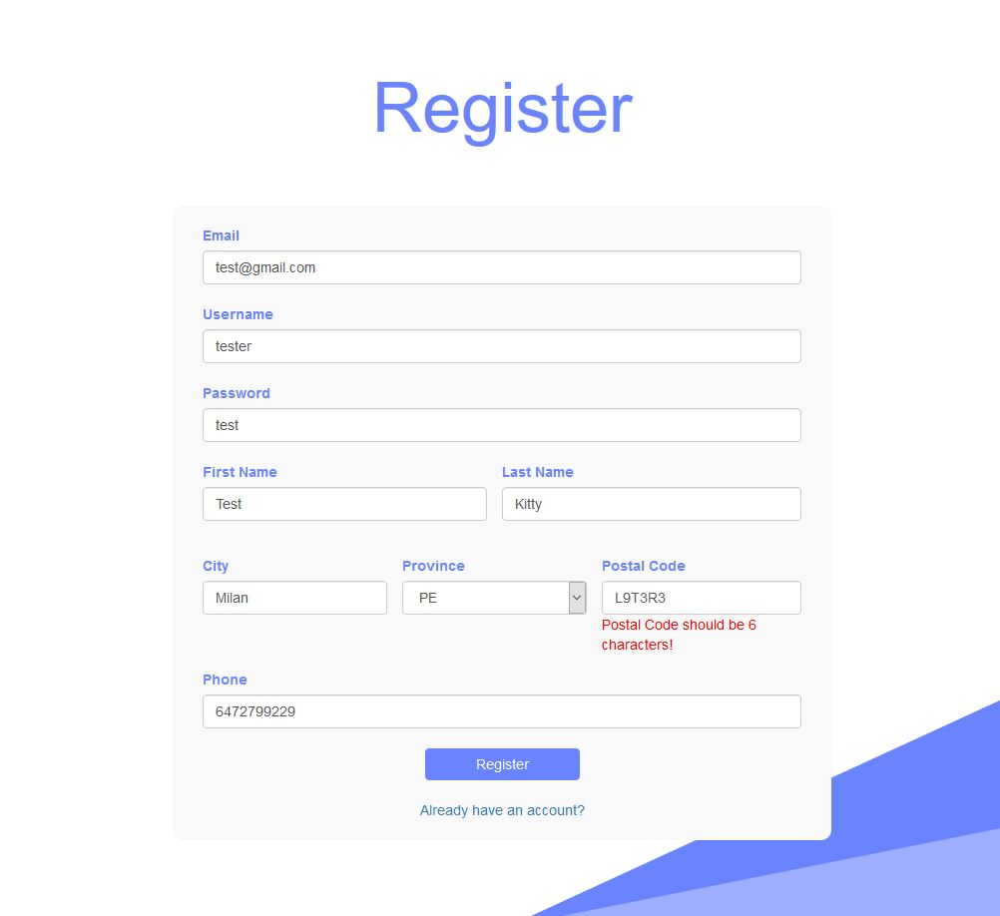
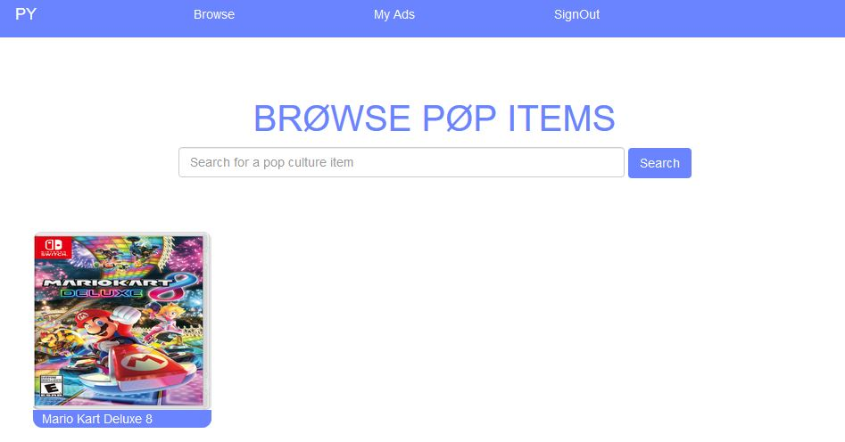
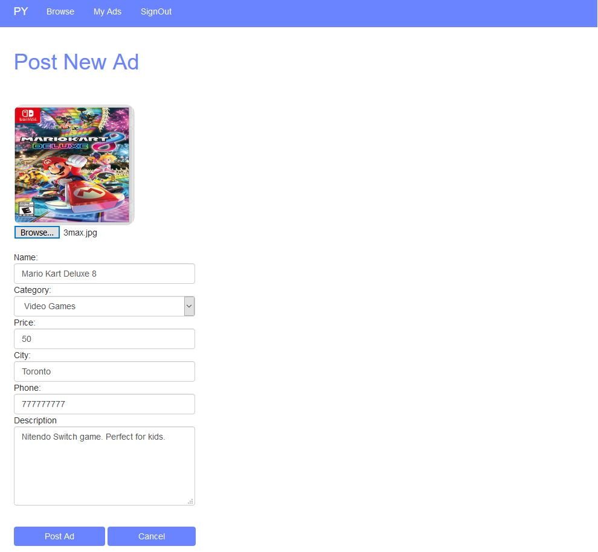

# PopYourself
Sell your pop culture items here. Walkthrough: https://youtu.be/x1zan_Gik7M

## To use the app
1. Simply install microsoft sql server client. Also Microsoft Sql Server Managment Studio.
2. Take the DatabaseScript/pop_cul_db.sql and run the script to initalize the database.
2. Install and open Visual Studio 2017 app the windows app only. 
3. Make sure the app is using 4.6 target framework.
4. Make sure that the web asp.net extension is downloaded inorder to run this app.
5. Inside the Util/PopCulDatabase.cs . make sure that the connection string matches the host string of your database.
6. Then click on the PopYourself.sln, and then click on the run button to start IIS server to run the app.
7. Now you can register user, and login and add posts and search post

## ~~ Login ~~

## ~~ Register ~~

## ~~ Browse Items ~~

## ~~ Post Ad ~~

## ~~ My Ads ~~

